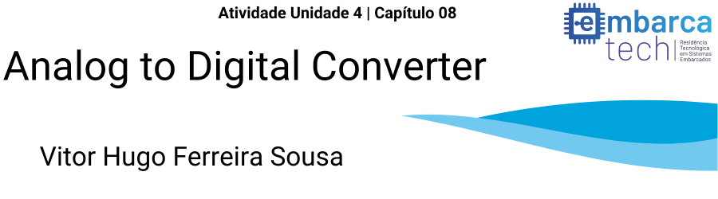

# Utilizando Joystick com ADC - Raspberry Pi Pico W
Atividade da Unidade 04 - Capítulo 08 - Embarca Tech
 
O programa desenvolvido neste repositório tem como objetivo principal aplicar tecnicas de controle de um joystick através de conversores analógico-digitais utilizando um microcontrolador Raspberry Pi Pico W.

# Requisitos e Instruções de Execução
 Para a execução desse código serão necessários os seguintes equipamentos:

#### Hardware
* Um Microcontrolador modelo __Raspbery Pi Pico W__
* Um display oled modelo __ssd1306__
* Um __LED RGB__
* Um Resistor de __330Ω Ohms__
* Um __Joystick Analógico__
* Dois __Push Buttons__

#### Software
* Instale o __Visual Studio Code IDE__
* Instale e configure o __Pico SDK__
* Instale __GNU Toolchain__
* Certifique-se de ter o __Git__ Instalado
* Instale as seguintes extensões no Visual Studio Code: __C/C++, C/C++ COMPILE RUN, Pi Pico W, Cmake e Cmake Tools__

#### Para utilizar e reprodução do projeto
* Clone o repositório
  ```bash
   git clone https://github.com/Vitorhugofsousa/Pi-Pico-ADC.git

* Compile o projeto
* Clique no arquivo __"diagram.json"__
* Selecione o botão __"Run"__ no canto superior esquerdo na tela de simulação


## Objetivo e Demonstração do código
__Joystick__: O código executará uma animação no display exibindo um quadrado com bordas simples nas laterais, ao mover o joystick o quadrado se moverá de forma correspondente pela tela.<br>
A movimentação do joystick irá resultar em uma alteração na cor do LED RGB, exibindo cores vermelhas de forma ascendente correspondendo ao _eixo X_, e cores azuis correspondendo a movimentação do _eixo Y_.
O cruzamento de valores entre esses dois eixos resultará em uma mistura visual gradual entre essas duas cores. <br>
__Botão JoysTick (SW_PIN)__: Ao pressionar o botão com a exibição de LED's ativada, exibirá a cor _verde_ no LED e simultâneamente executará uma mudança na animação do display. <br>
__Botão A__: Ao pressionar o __botão A__ a exibição dos LED's será desativada, pressionando novamente será reativada.<br>
__Botão B__: Ao pressionar o __botão B__ a exibição do display será desativada, pressionando novamente será reativada.<br>

#### Ao clicar __[Aqui](https://youtu.be/Fy0wzCUtTwc)__ verá um vídeo no __YouTube__ explicando o funcionamento completo do Código.

# Contribuições


